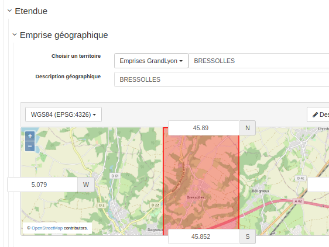

# Migration GrandLyon - Middle, Back|Othu > GeoNetwork 3.10.4

## Import db

```sql
-- Cleanup
DROP DATABASE IF EXISTS gl_back;
DROP DATABASE IF EXISTS gl_middle;
DROP DATABASE IF EXISTS gl_othu;
 
-- Create
CREATE DATABASE gl_back
  WITH OWNER "www-data";
CREATE EXTENSION postgis;
CREATE DATABASE gl_middle
  WITH OWNER "www-data";
CREATE DATABASE gl_othu
  WITH OWNER "www-data";
```


Import dump:

```shell script
DUMP_DIR=/data/project/2021/grandlyon/prod
pg_restore -h localhost -U www-data -W  -d gl_back $DUMP_DIR/DIVREC_geosource_20200809_2205.pgd
psql -h localhost -U www-data -W -f $DUMP_DIR/dump_middle.sql gl_middle
psql -h localhost -U www-data -W -f $DUMP_DIR/dump_othu.sql gl_othu
```

## Vérification & problèmes

### Versions utilisées

```sql
SELECT * FROM settings WHERE name LIKE '%version'
othu=3.10.3
back=3.0.2
middle=3.0.2
```

### Middle

#### Subtemplate en profil France!

```sql
SELECT schemaid, count(*) FROM metadata GROUP BY 1;
SELECT uuid, istemplate FROM metadata WHERE schemaid = 'iso19139.fra'
1bbcb326-8f72-4479-b708-0bea8a3998be,s
6ab880f5-1440-4090-b777-93f4e8bdfe7d,s
```
2020-10-21 19:20:09,681 ERROR [geonetwork.datamanager] - The metadata document index with id=1196 is corrupt/invalid - ignoring it. Error: Schema not registered : iso19139.fra

= Supprimé. A priori non utilisé.


#### Géométrie invalide


```xml
2020-10-21 19:20:14,601 ERROR [geonetwork.index] - Failed to convert gml to jts object: <gml:Polygon xmlns:gml="http://www.opengis.net/gml">
  <gml:exterior>
    <gml:LinearRing>
      <gml:coordinates>,48.67,
                2.33,48.67, 2.33,45.437, ,45.437, ,48.67</gml:coordinates>
    </gml:LinearRing>
  </gml:exterior>
</gml:Polygon>
```

= A voir - plusieurs fiches concernées


#### XLINK invalides

```
2020-10-21 19:21:52,764 ERROR [jeeves.xlinkprocessor] - Failed on http://geosource.grandlyon.fr:80/geosource/srv/fre/subtemplate?uuid=dc7808f2-278e-4667-bc0b-5d69ec259a19&process=gmd:role/gmd:CI_RoleCode/@codeListValue~custodian&
java.net.UnknownHostException: geosource.grandlyon.fr

2020-10-21 19:23:19,202 ERROR [geonetwork] - Failed fetching url: http://geosource.grandlyon.fr/geosource/srv/fre/csw?service=CSW&request=GetRecordById&version=2.0.2&outputSchema=http://www.isotc211.org/2005/gmd&elementSetName=full&id=
```

A priori, des choses qui n'existent plus.

= A voir 

#### De vieux liens

```
http://geosource.grandlyon.fr/geosource/images/harvesting/VilledeLyon.gif
> 
https://download.data.grandlyon.com/catalogue
```

= Fait à la migration SQL.

#### Changement de lien pour l'API GeoNetwork

* Changement d'API pour les fichiers attachés (vérifier les scripts de changement d'URL ? Action Neogeo)

```
http://localhost:8080/catalogue/srv/fre/resources.get?uuid=9ac9ceee-5339-4fb2-8014-71459b94253e&fname=Licence ODBL&access=public
> 
http://localhost:8080/geonetwork/srv/api/records/4196eb59-db70-4aed-925a-0aaffa2bf3d1/attachments/carto_2RM_T600_s.png
```
   
### Othu

Pas grand chose. Toutes les langues de GeoNetwork sont là. On peut limiter à Français / Anglais pour alléger.

Admin > Paramètres > Eviter de mettre un port ''. Utiliser 80 pour HTTP.


## Migration

La migration consiste en 3 étapes


* Migration SQL (cf. [migrate-3104.sql](migrate-3104.sql) pour le middle et [migrate-3104-othu.sql](migrate-3104-othu.sql) pour othu). Application des migrations "standards" GeoNetwork depuis la version de l'appli + quelques corrections/configurations en SQL en fin de script.

* Correction via l'API (après démarrage de l'appli) (cf. [migrate-3104.sh](migrate-3104.sql) pour le middle et [migrate-3104-othu.sh](migrate-3104-othu.sql) pour othu). 
   

## Installation

Pour le déploiement, vérifier la configuration du datadir (et du schéma dir) dans les JAVA_OPTS. eg.

```
-Dgeonetwork.dir=/data/catalog \
-Dgeonetwork.schema.dir=/app/webapp/WEB-INF/data/config/schema_plugins
```

Pour pointer vers une base de données, il est possible d'utiliser les variables d'environnement:

```
export GEONETWORK_DB_TYPE=postgres
export GEONETWORK_DB_HOST=localhost
export GEONETWORK_DB_PORT=5432
export GEONETWORK_DB_NAME=gl_middle_4
export GEONETWORK_DB_USERNAME=www-data
export GEONETWORK_DB_PASSWORD=www-data
export GEONETWORK_DB_CONNECTION_PROPERTIES=
./startup.sh -f
```


## Test

Utiliser les sources:

```shell
mvn clean install -DskipTests
cd web
mvn jetty:run -Ddb.type=postgres -Ddb.port=5432 -Ddb.name=gl_middle -Ddb.username=www-data -Ddb.password=www-data -Dgeonetwork.dir=/data/project/2021/grandlyon/prod/middle/WEB-INF/data -Dgeonetwork.schema.dir=/data/dev/gn/gl/web/src/main/webapp/WEB-INF/data/config/schema_plugins
```


## Recommandations pour la configuration

* Créer une fiche pour le CSW et l'utiliser pour le GetCapabilities cf. https://geonetwork-opensource.org/manuals/trunk/en/administrator-guide/configuring-the-catalog/csw-configuration.html (si on souhaite être conforme INSPIRE)

* Activer la résolution XLink > A été désactivé

* Stat de la recherche > A été désactivé

* Logo importés

* Thésaurus importés (EmpriseGL) ou mis à jour (GEMET, INSPIRE)

* Editeur / Configuration du choix des emprises:




## Interface

Configuration simple possible à partir de http://localhost:8080/geonetwork/srv/eng/admin.console#/settings/cssstyle

eg.
```json
{
gnSearchOutlineColor: "#DA322F",
gnResultcardTitleBackgroundColor: "#DA322F",
gnBackgroundImage: "https://data.grandlyon.com/assets/img/home_image.jpg",
gnSearchButtonBackgroundColor: "#DA322F"
}
```

## Remarques


* GML / Changement de version et donc de namespace http://www.opengis.net/gml > http://www.opengis.net/gml/3.2 = Peut avoir un impact si des process manipule le XML ?
* API / http://localhost:8080/catalogue/srv/fre/resources.get a changé. http://localhost:8080/geonetwork/srv/api/records/4196eb59-db70-4aed-925a-0aaffa2bf3d1/attachments/carto_2RM_T600_s.png


## Améliorations GeoNetwork 

Certaines fiches OTHU (eg. Physico-chimie des précipitations et des eaux de surface sur sous-bassin du Ratier (bassin versant de l'Yzeron), depuis 2017) contiennent plusieurs hierarchyLevel qui cause un pb en vue avancée. Corrigé par https://github.com/geonetwork/core-geonetwork/pull/5109


Autres points :
* https://github.com/geonetwork/core-geonetwork/pull/5110
